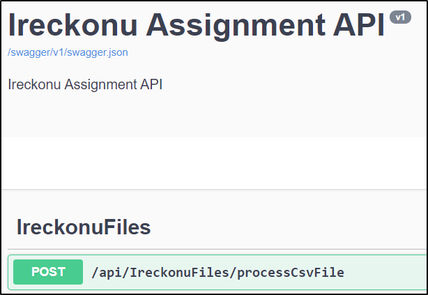
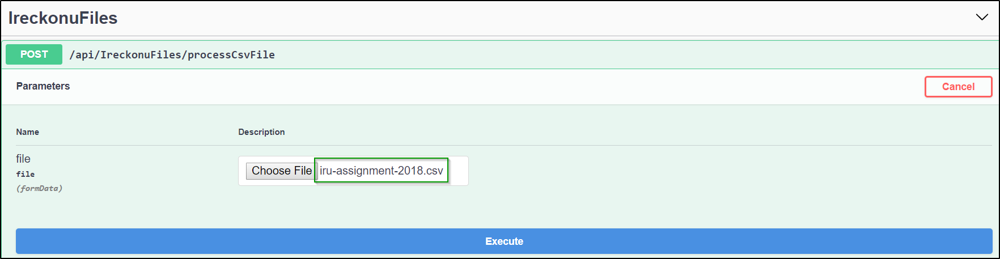
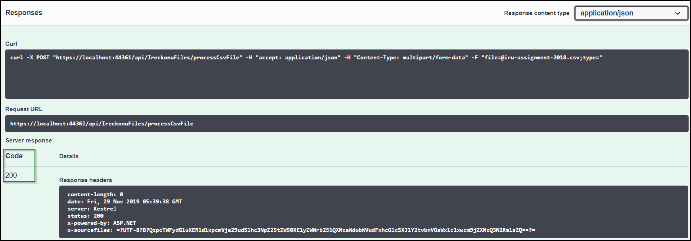
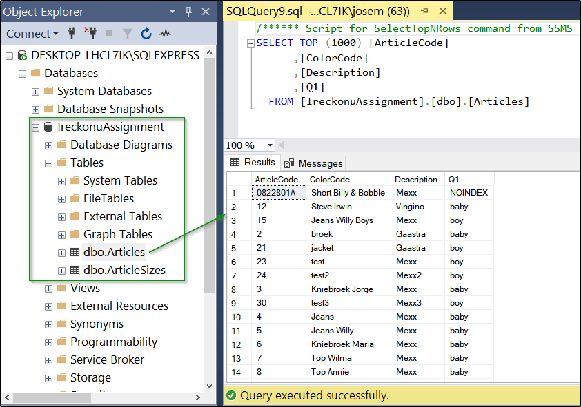
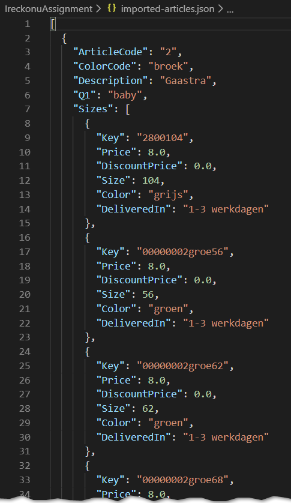

# ireckonu-assignment
This repository contains the API implemented as part of the Ireckonu Assignment.

## Notes and considerations
* The code follows coding style from StyleCop.
* The .Net Core project was implemented using Visual Studio 2019 and Windows 10.
* A few unit tests were implemented to show that the classes to be tested can be instantiated with "mocked" dependencies. Code for an actual project would require more scenarios to be covered.
* A basic normalization was applied to the data because I do not have enough context about the exact meaning of each column of data. An actual project would require additional samples of data, more analysis and possible interviews with people that are familiar with the data. 
The normalization was just implemented with the intent of showing how the normalization functionality was included in the solution.
* Since this is just a "demo" project:
  * It was configured to delete and re-create the SQL Database every time the project is executed.
  * The logic was designed to take the data from the posted file and save it. No additional information about the import process is stored (e.g. timestamp or imported file name) and no multiple imports are supported.

## Implementation
The main logic is organized in the following projects:
* <b>IreckonuAssignment</b>: Web API project containing the endpoint to receive the CSV file.
* <b>IreckonuAssignment.BusinessLogic</b>: Contains logic to process the imported data. Applies a basic "normalization" and calls the functionality to save the data.
* <b>IreckonuAssignment.DataAccess</b>: Represents the Data Access Layer. This project contains an interface declaring a method to save data. Two other projects implement that interface:
  * <b>IreckonuAssignment.DataAccess.Db</b>: Contains functionality to save data to a SQL Database using Entity framework. The connection string can be configured in the "appsettings.json" file.
  * <b>IreckonuAssignment.DataAccess.Json</b>: Contains functionality to save data to a JSON file. The file path can be configured in the "appsettings.json" file.

Dependency injection was implemented using the default mechanism offered by .NET core.

## Running the application
Swagger was configured as the startup page of the API project. From there, the API endpoint can be tested.

### Configurations
Make sure to configure the connection string for the Database and the path to the JSON file to be created.
Both configurations should be applied in the "appsettings.json" file. 
<b>NOTE</b>: Keep in mind that the DB referenced by the connection string would be removed and re-created with the corresponding tables when the application is executed.

### Executing the code
1. Run the application. The Swagger page should be displayed, listing a single API endpoint:

2. Expand the endpoint information and click on "Try it out".
3. Next to the "file" parameter, a control to choose a file should be displayed. Use it to select a sample file:

4. Click on "Execute". The file should be posted. A new database and a JSON file should be created with the data.

5. The data from the sample file should be saved to the database and the JSON file:
  * Created database with imported data:

  

  * Created JSON file with imported data:

  